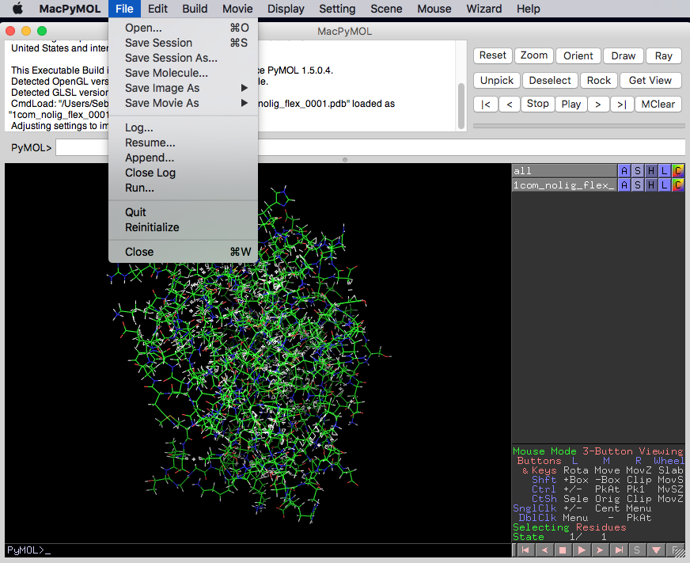
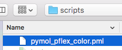
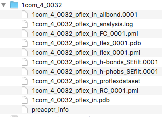
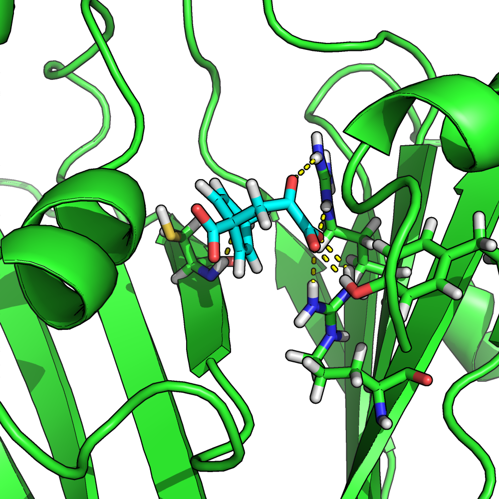

# Organizing the Protein Docking Poses as PDB files

- After you successfully docked the ligand into the protein's binding site
- Prepare docking poses as PDB files containing protein and ligand for each docking pose
- Also, prepare the ligand-free structure of the protein
- Prior to ProFlex, make sure the proteins have protons
- You can use Reduce for instance
- We recommend you put each docking pose into a separate directory, for instance as in examples/proflex_input
    - for ? docking poses + ligand-free structure + crystal structure


# Determining a Reasonable Energy Cut-Off for Hydrogen Bonds

```bash
cd 1com_nolig/
```

```bash
proflex -h 1com_nolig.pdb
```


```
Number of H-bonds remaining: 202

Number of H-phobic tethers remaining: 166

		 Filter on Hydrogen Bond Energy:
		 ~~~~~~~~~~~~~~~~~~~~~~~~~~~~~~~

	All current hydrogen bonds have energies between:
	    -9.8419 Kcal/Mol  to  0.0226 Kcal/Mol

	Enter a maximum acceptable hydrogen bond energy (in Kcal/Mol)
	(-1.0 is a reasonable cutoff in general): 0
```


```

    ANALYSIS MENU

  What would you like to perform:

    (1) Flexibility and rigidity analysis
    (2) Hydrogen bond dilution
2
```

```
  Which hydrogen bond dilution analysis would you like?

   (1) Standard hydrogen bond dilution, removing weakestH-bonds, one at a time

   (2) Random dilution over all H-bonds.
       NOTE: This option is *not* recommended;
             It may be used to probe the influence of H-bond
             density, as opposed to strength, on rigidity

1
```


```bash
~/Desktop$ python siteinterlock-toolkit/scripts/hether.py\
--input1 examples/proflex_output/1com_nolig/1com_nolig_proflexdataset\
--input2 examples/proflex_output/1com_nolig/decomp_list 
```

Output:

```
SiteInterlock version 1.0.0
Author: Sebastian Raschka
Timestamp: 2016-08-12T15:38:17

==============
HETHER results
==============
Suggested energy threshold: -0.806 kcal/mol
Number of rigid clusters: 4
Relative rigidity [0, 1]: 0.83
```

- suggest saving this to a logfile


# Optional: Visualizing Rigid and Flexible Clusters in PyMOL

proflex -h 1com_nolig.pdb 


```
Number of H-bonds remaining: 202

Number of H-phobic tethers remaining: 166

		 Filter on Hydrogen Bond Energy:
		 ~~~~~~~~~~~~~~~~~~~~~~~~~~~~~~~

	All current hydrogen bonds have energies between:
	    -9.8419 Kcal/Mol  to  0.0226 Kcal/Mol

	Enter a maximum acceptable hydrogen bond energy (in Kcal/Mol)
	(-1.0 is a reasonable cutoff in general): -0.806
```

```
    ANALYSIS MENU

  What would you like to perform:

    (1) Flexibility and rigidity analysis
    (2) Hydrogen bond dilution
1

```


- open file 1com_nolig_flex_0001.pdb in pymol



- run scripts/pymol_pflex_color.pml




# ProFlex Analysis on Docking Poses

- proflex -h <docking_pose>.pdb
- for instance, 
    - `proflex -h 1com_4_0032_pflex_in.pdb`

- example files in examples/slide-propmap

- run python scripts/slide-propmap.py --input1 ~/Desktop/1com_crystal.mol2 --input2 ~/Desktop/confs_1com_0.pts

```
SiteInterlock version 1.0.0
Author: Sebastian Raschka
Timestamp: 2016-08-12T18:22:46

================
PROPMAP results
================
C1 --> hydrophobic contact
C3 --> hydrophobic contact
C5 --> hydrophobic contact
C8 --> hydrophobic contact
O1 --> b [H-bond Donor and/or Acceptor]
O2 --> a [H-bond Acceptor]
O3 --> a [H-bond Acceptor]
O4 --> a [H-bond Acceptor]
O5 --> a [H-bond Acceptor]
O6 --> a [H-bond Acceptor]
```


```
---------------------------------------------------------
	Identification of H-bond Donors, Acceptors etc.

	(d) H-bond Donor 
	(a) H-bond Acceptor 
	(b) Both H-bond Donor and H-bond Acceptor 
	(c) Charged Donor 
	(e) Charged Acceptor 
	(n) None 
---------------------------------------------------------
	Enter (a,b,c,d,e or n) for the following atoms.

	 Atom#  Atom  Res    Res#    Chain
	 3755    O1   <0>       1          Enter (a,b,c,d,e or n): b
	 3757    O2   <0>       1          Enter (a,b,c,d,e or n): a
	 3759    O3   <0>       1          Enter (a,b,c,d,e or n): a
	 3761    O4   <0>       1          Enter (a,b,c,d,e or n): a
	 3763    O5   <0>       1          Enter (a,b,c,d,e or n): a
	 3765    O6   <0>       1          Enter (a,b,c,d,e or n): a
```

blablabla

```
    ANALYSIS MENU

  What would you like to perform:

    (1) Flexibility and rigidity analysis
    (2) Hydrogen bond dilution
1
```



on 1com_0057_pflex_in_flex_0001.pdb:


- repeat that for all docking poses
- collect them somewhere


# Optional: Visualizing H-bond Interactions between Proteins and Ligands


restart

To draw the intermolecular interactions (hydrogen bonds) as assessed by ProFlex, you need to 

1. Run `python scripts/grab_bonds_proflexdataset.py -i my_proflexdataset`. 

For instance

`python scripts/grab_bonds_proflexdataset.py -i my_proflexdataset`

`~/Desktop/siteinterlock-toolkit$ python scripts/pflex-bondviz.py -i examples/proflex_output/1com_0057/1com_0057_pflex_in_proflexdataset -b hbonds`

```
Atom#1 Atom#2
1951 3761
1949 3755
3269 3759
3566 3755
3266 3761
1185 3765
```


Copy and paste the results from the screen to a new text file or run the command again and pipe the output to a file

`python grab_bonds_proflexdataset.py -i my_proflexdataset > hbonds.txt`





3. Open the renamed proflexdataset.pdb file in PyMOL and draw the bond lines (using my BondVis PyMOL plugin, which reads in this grab_bonds_proflexdataset.py result file; examples and instructions for BondVis plugin can be found on the PSA wiki: [https://sol.bch.msu.edu/mediawiki/index.php/BondVis_Plugin_for_PyMOL](https://sol.bch.msu.edu/mediawiki/index.php/BondVis_Plugin_for_PyMOL).)

4. Hide all atoms in PyMol  (you will have noticed that the secondary structure cannot be displayed properly). 

5. Now, open the Prolfex in- or output PDB file and overlay it with the bonds that where just drawn using the renamed proflexdataset.pdb file.

This hack of using the proflexdataset file to draw the bonds and the PDB output file for actually overlaying the bonds with the protein structure was necessary because  the atom numbers given in the `REMARK:HB` and `ATOM` section of the proflexdataset file differ from the numbers in the output PDB file.


```python

```
