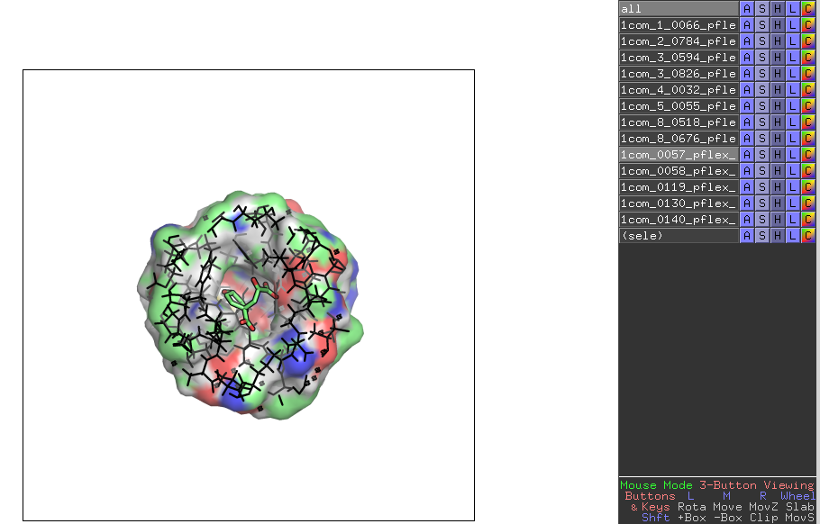

# Test

```bash
python scripts/get-substructures.py \
--input examples/proflex_output/all-docking-poses-pdbs/ \
--output examples/proflex_output/all-docking-poses-pdbs-9A/ \
--ligand "<0>" \
--apply_to_dir
```

|

```bash
~/Desktop/siteinterlock-toolkit$ python scripts/siteinterlock-score.py -i examples/proflex_output/all-docking-poses-pdbs-9A/

#
# SiteInterlock version 1.0.0
# Author: Sebastian Raschka
# Timestamp: 2016-08-17T14:37:12
#
# ==============================
# SiteInterlock Scoring Results
# ==============================
1com_0057_pflex_in_flex_0001.pdb,-1.393
1com_8_0676_pflex_in_flex_0001.pdb,-0.863
1com_0140_pflex_in_flex_0001.pdb,-0.776
1com_0058_pflex_in_flex_0001.pdb,-0.600
1com_crystal.pdb,-0.581
1com_4_0032_pflex_in_flex_0001.pdb,-0.562
1com_0119_pflex_in_flex_0001.pdb,-0.560
1com_5_0055_pflex_in_flex_0001.pdb,0.105
1com_1_0066_pflex_in_flex_0001.pdb,0.106
1com_3_0826_pflex_in_flex_0001.pdb,0.356
1com_3_0594_pflex_in_flex_0001.pdb,0.485
1com_0130_pflex_in_flex_0001.pdb,1.062
1com_2_0784_pflex_in_flex_0001.pdb,1.477
1com_8_0518_pflex_in_flex_0001.pdb,1.746
```

# Optional


```python
import pandas as pd

df1 = pd.read_csv('../../../examples/proflex_output/all-docking-poses-pdbs-9A.csv', comment='#')
df2 = pd.read_csv('../../../examples/1com_rmsds.csv')
```


```python
df3 = df1.merge(right=df2, on='Filename')
df3.sort_values('RMSD', inplace=True)
df3
```


<div>
<table border="1" class="dataframe">
  <thead>
    <tr style="text-align: right;">
      <th></th>
      <th>Filename</th>
      <th>SiteInterlock_Score</th>
      <th>RMSD</th>
    </tr>
  </thead>
  <tbody>
    <tr>
      <th>0</th>
      <td>1com_0057_pflex_in_flex_0001.pdb</td>
      <td>-1.431</td>
      <td>0.3592</td>
    </tr>
    <tr>
      <th>2</th>
      <td>1com_0140_pflex_in_flex_0001.pdb</td>
      <td>-0.810</td>
      <td>1.0010</td>
    </tr>
    <tr>
      <th>3</th>
      <td>1com_0058_pflex_in_flex_0001.pdb</td>
      <td>-0.649</td>
      <td>1.2555</td>
    </tr>
    <tr>
      <th>6</th>
      <td>1com_1_0066_pflex_in_flex_0001.pdb</td>
      <td>0.055</td>
      <td>1.5126</td>
    </tr>
    <tr>
      <th>5</th>
      <td>1com_0119_pflex_in_flex_0001.pdb</td>
      <td>-0.601</td>
      <td>1.7488</td>
    </tr>
    <tr>
      <th>10</th>
      <td>1com_0130_pflex_in_flex_0001.pdb</td>
      <td>1.026</td>
      <td>1.9982</td>
    </tr>
    <tr>
      <th>4</th>
      <td>1com_4_0032_pflex_in_flex_0001.pdb</td>
      <td>-0.603</td>
      <td>2.2476</td>
    </tr>
    <tr>
      <th>8</th>
      <td>1com_3_0826_pflex_in_flex_0001.pdb</td>
      <td>0.326</td>
      <td>2.4965</td>
    </tr>
    <tr>
      <th>9</th>
      <td>1com_3_0594_pflex_in_flex_0001.pdb</td>
      <td>0.401</td>
      <td>2.7501</td>
    </tr>
    <tr>
      <th>11</th>
      <td>1com_2_0784_pflex_in_flex_0001.pdb</td>
      <td>1.419</td>
      <td>2.9999</td>
    </tr>
    <tr>
      <th>1</th>
      <td>1com_8_0676_pflex_in_flex_0001.pdb</td>
      <td>-0.896</td>
      <td>3.5653</td>
    </tr>
    <tr>
      <th>7</th>
      <td>1com_5_0055_pflex_in_flex_0001.pdb</td>
      <td>0.067</td>
      <td>3.9528</td>
    </tr>
    <tr>
      <th>12</th>
      <td>1com_8_0518_pflex_in_flex_0001.pdb</td>
      <td>1.696</td>
      <td>4.8813</td>
    </tr>
  </tbody>
</table>
</div>


```python
import matplotlib.pyplot as plt

with plt.style.context('fivethirtyeight'):
    plt.plot(df3['RMSD'].values, df3['SiteInterlock_Score'].values)
    plt.xlabel('RMSD in Angstrom')
    plt.ylabel('SiteInterlock Score')
    plt.tight_layout()
    plt.savefig('images/1com_scores.png', dpi=200)
```


```python

```
